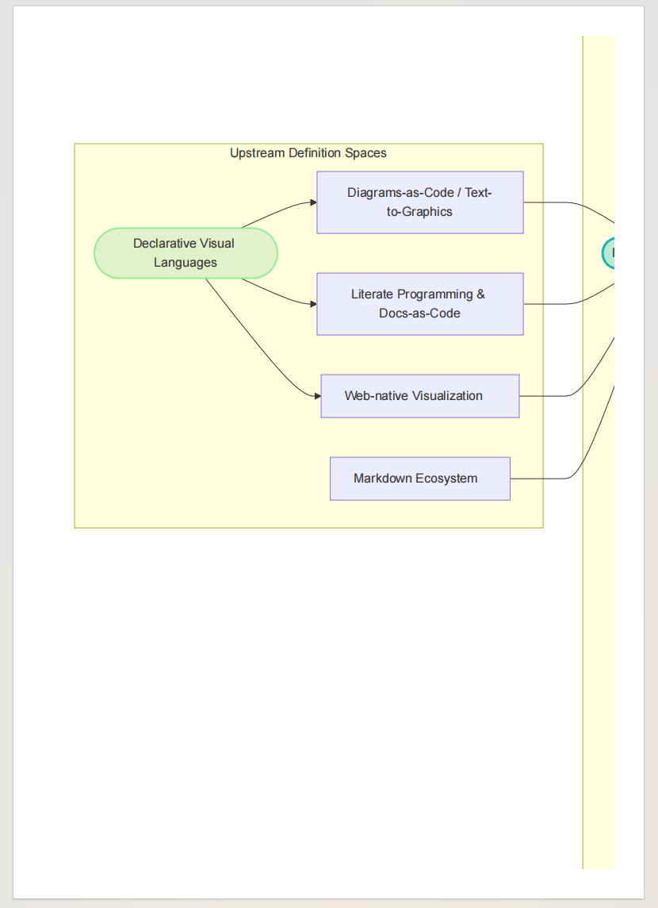
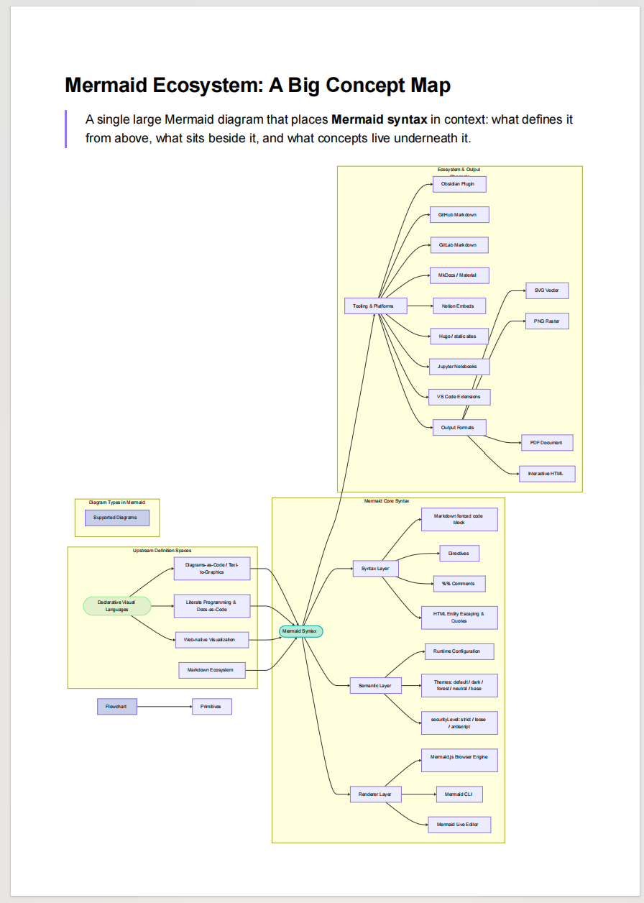

# Mermaid Export Fit

Mermaid Export Fit keeps wide Mermaid diagrams visible in Obsidian and prevents them from breaking during PDF/HTML export.

It is intentionally invisible in daily use: install it, restart your Obsidian vault, and keep writing Mermaid as usual.

## Why This Exists

Large Mermaid diagrams often have a natural width that is wider than the Obsidian reading pane or PDF page. Without export-aware fitting, the right side of the diagram can be clipped in the exported document.

Kudos to this plugin: [Mermaid Popup](https://community.obsidian.md/plugins/mermaid-popup). It is useful for inspecting Mermaid diagrams inside Obsidian. Mermaid Export Fit focuses on a different pain point: keeping the diagram intact when the note is exported to PDF or HTML.

Before Mermaid Export Fit, a large diagram can be clipped in the exported PDF:

After Mermaid Export Fit is installed, the exported PDF keeps the whole diagram visible:

## Features

1. Preserves Mermaid SVG clarity instead of forcing every diagram to shrink in normal reading.
2. Adds horizontal scrolling when a diagram is wider than the reading pane.
3. Fits Mermaid diagrams to page width during PDF and HTML export.
4. Provides an English-first settings page with a globe button for English/Chinese switching.

## Installation

1. Copy the `mermaid-fit/` folder into your vault's `.obsidian/plugins/` directory.
2. In Obsidian, open Settings -> Community plugins and enable community plugins.
3. Enable **Mermaid Export Fit**.
4. Restart or reload your Obsidian vault.
5. Done. The plugin works automatically with no extra setup.

## Usage

There is no workflow to learn. Once the plugin is enabled and the vault has been restarted, Mermaid diagrams are adjusted automatically in reading mode, live preview, and export.

## Language

The plugin uses English by default. Open Settings -> Community plugins -> Mermaid Export Fit, then click the globe icon in the upper-right of the plugin settings page to switch between English and Chinese.

## Commands

Open the command palette with `Ctrl+P`:

| Command | Action |
| --- | --- |
| **Refresh all Mermaid diagrams** | Re-scan the current workspace and apply Mermaid fit behavior. |
| **Scale Mermaid diagrams to fit container** | Force Mermaid SVGs to fit the available width. |

## Settings

- **Enable horizontal scrolling**: Keep wide diagrams scrollable without clipping.
- **Fit diagrams when exporting**: Scale Mermaid SVGs to page width for PDF/HTML export.

## Privacy

Mermaid Export Fit works locally in Obsidian. It does not use the network, collect telemetry, or send vault content to any service.

## Compatibility

- Obsidian desktop
- Obsidian mobile
- PDF export
- HTML export
- Slides/presentation views

## License

MIT. See [LICENSE](LICENSE).

## 中文简介

Mermaid Export Fit 默认使用英文界面，可在插件设置页右上角点击地球图标切换为中文。它解决的核心痛点是：大型 Mermaid 图表在 Obsidian 内部可以想办法查看，但一旦导出为 PDF/HTML 仍可能被裁切；安装本插件并重启 vault 后，导出也会自动适配，不需要额外操作。

版本: 1.0.0
